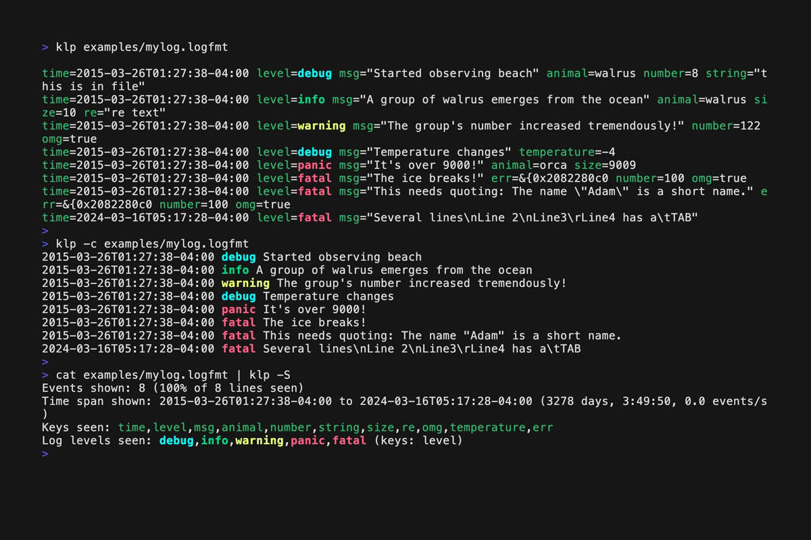

# klp

_Kool Logfmt Parser_

klp is a lightweight, command-line interface (CLI) tool  for analyzing and understanding structured logs in various formats.
Designed for software developers involved in debugging and troubleshooting.

Supports [logfmt](https://brandur.org/logfmt), [JSON Lines](https://jsonlines.org), [TSV](https://en.wikipedia.org/wiki/Tab-separated_values) and some other formats.

Single file Python script without dependencies apart from Python 3.7+ and its standard library. 



## Key Features

- **Focus on the Essentials**: Instantly view the crucial fields: timestamp, log level, and message.
- **Selective Key Display**: Choose to include or exclude specific keys in your output.
- **Powerful Filtering**: Filter logs by log level or specific time ranges, e.g. to focus on new events. Employ Python expressions to specify complex filters.
- **Advanced Grep Capabilities**: Search whole lines or specific keys. Show context lines to see what happened right before or after an interesting event. Use built-in regexes for URLs, IPs, file paths or common errors.
- **Overview Stats**: Get a bird's eye view of your logs with a statistics page summarizing event count, keys, log levels, and time span. Or with a map of log levels.
- **Customizable Output**: Expand newlines, print each key on a separate line, or specify your own output templates, using Python [f-strings](https://realpython.com/python-f-strings/) or expressions
- **Enhanced Readability**: Enjoy colored and pretty-printed output for easier reading.
- **Supports JSON Lines and TSV** as alternative input/output formats (and some others)

klp is designed not for large-scale log analysis, but as a lightweight, efficient tool for developers. It's your companion for uncovering the mysteries in your logs, streamlining your development workflow, and accelerating troubleshooting.

## Installation

Install using pip:

```bash
$ pip install klp-logviewer
```

Or copy `klp.py` to a folder on your PATH and make it executable:

```bash
$ install -m 755 klp.py ~/.local/bin/klp
```

Or just run it using `python3`, without any installation.


## Quick Start

Here are some basic examples to get you started with klp:

```bash
# View logs with timestamp, log level, and message:
$ klp -c mylog.logfmt

# Specify the input format (default is logfmt):
$ klp -f jsonl applog.jsonl
$ klp -f csv mydata.csv

# Filter logs by log level:
$ klp -l error,warning mylog.logfmt

# Get an overview of your log data:
$ klp -S mylog.logfmt

# View only new log entries (useful with streaming logs):
$ tail -f mylog.logfmt | klp -n
```

## Usage

klp can be used as a filter, reading from stdin:

```bash
$ tail -f log.txt | klp
```

Or you can read from a file:

```bash
$ klp log.txt
```

klp can directly process compressed log files:

```bash
$ klp app.log.gz
$ klp logs.zip
```

Options can be given before or after the filename.

See `klp --help` for the list of available options.

### Supported input formats

klp supports a wide range of input formats:

- `logfmt`: Key-value pairs (**default**)
- `jsonl`: JSON Lines (shortcut: `-j`)
- `json`: JSON (only for complete files, not for streaming)
- `tsv`: Tab separated values 
- `psv`: Pipe separated values 
- `clf`: NCSA Common Log Format
- `combined`: Combined Log Format of Apache httpd
- `unix`: common format of Unix server logs (timestamp, hostname, service, optional pid, message)
- `line`: lines of text (trailing whitespace removed)
- `sqlite`: SQLite database 
- `data`: parse everything as one string 
- `tsNm`: timestamp (consisting of N components) and message
- `tsNlm`: timestamp (consisting of N components), log level and message

Use the `--input-format` or `-f` option to specify the input format. For example:

```bash
$ klp -f jsonl input.log
```

klp supports parsing simple space-separated log formats via the `tsNm` (timestamp + message) and `tsNlm` (timestamp + level + message) format specifiers,
where N indicates how many space-separated timestamp components to expect.
Here are some examples:

```bash
# Log format: <timestamp> <message>
# Example:    2024-02-05T20:18:10.538Z Connection established to database
$ klp -f ts1m server.log

# Log format: <date> <time> <level> <message>
# Example:    2024-02-05 20:18:10 INFO Starting background worker
$ klp -f ts2lm worker.log

# Log format: <date> <time> <timezone> <message>
# Example:    2024-02-05 20:18:10 UTC Processing batch job #1234
$ klp -f ts3m batch.log
```

Similar formats exist up to `ts5m`/`ts5lm` for logs with more timestamp components.
The timestamp parts are joined and parsed using klp's standard timestamp parsing logic.

More complicated formats can often be parsed using the `line` format and creating or transforming events using Python code (`--input-exec`).
See the *Advanced input transformations using Python code* section below.

### Basics

klp parses each line of the input file (or stdin stream) into an *event*.
If a line cannot be parsed, it is ignored silently.
An event can have several *fields* (key/value pairs).
The events in a file or stream don't have to have the same fields.

klp tries to automatically detect timestamps, log levels and log messages
by looking for the following keys:

* Timestamp keys: `timestamp`, `time`, `ts`, `t`, `at`
* Log level keys: `log_level`, `loglevel`, `level`, `lvl`, `severity`
* Message keys: `message`, `msg`

klp has special features to select events by timestamp or log level (see below).


### Default output

By default, klp prints every event that was recognized and shows both the key and the value of each field.
Colors are used for syntax-highlighting (use `--no-color` to turn this off or `--theme` to select different colors).

### Common output format: timestamp, log level, message

Often the time stamp, log level and message are the most important fields.
Use `--common`/`-c` to print them, without showing the names of the keys (only the values):

```bash
$ klp -c mylog.txt
2023-01-17T07:55:48.233Z DEBUG preparing query s190578: select * from applications
2023-01-17T07:55:48.234Z DEBUG executing statement s190578 with parameters: []
2023-01-17T07:55:48.656Z DEBUG preparing query s190579: select * from oauthproviderconfig where id = 0
2023-01-17T07:55:48.657Z DEBUG executing statement s190579 with parameters: []
2023-01-17T07:55:48.662Z DEBUG preparing query s190580: select * from oauthproviderconfig where id = 0
2023-01-17T07:55:48.663Z DEBUG executing statement s190580 with parameters: []
```

### Get an overview of the log data

Use `--stats-only`/`-S` to get some basic statistics about number of events in the log file,
the timespan, the names of the keys and the log levels:

```bash
$ klp -S mylog.logfmt
Events shown: 8043 (100% of 8043 lines seen)
Time span shown: 2024-02-05T19:58:59.874Z to 2024-02-05T20:19:20.575Z (0:20:20.701000)
Keys seen: timestamp,log_level,source,target,thread_id,message
Log levels seen: DEBUG,TRACE,INFO (keys: log_level)
```

Or use `--stats`/`-s` to print those stats (to stderr), in addition to regular output.

Use `--levelmap`/`-M` to print only the first character of the log level of each event.
The timestamp is for the first event shown in that line:

```bash
$ klp -M mylog.logfmt
2024-02-05T20:18:10.538Z TTTTDTTTDITITTTTTTTTTTTTTTTDTTTDITITTTTTTTTTTTTTTTDTTTDITITTTTTTTTTTTTTTTDTTTDIT
2024-02-05T20:18:30.546Z ITTTTTTTTTTTTTTTDDTTITITTTTTTTTTTTTTTITITTTTTTTTTTTTTTTTITITTTTTTTTTTTTTTTTITITT
2024-02-05T20:18:34.098Z TTTTTTTTTTTTTDTTTDITITTTTTTTTTTTTTTTDDTTTDITITTTTTTTTTTTTTTTDTTTDITITTTTTTTTTTTT
2024-02-05T20:18:45.555Z TTTDTTTDITITTTTTTTTTTTTTTTDTTTDITITTTTTTTTTTTTTTTDTTTDITITTTTTTTTTTTTTTTDTITITTT
2024-02-05T20:19:02.666Z TTTTDTTTTTTTTTITITTTTTTTTTTTTTTTDTTTDITITTTTTTTTTTTTTTTDTTTDITITTTTTTTTTTTTTTTDT
2024-02-05T20:19:15.571Z TTDITITTTTTTTTTTTTTTTDTTTDITITTTTTTTTTTTTTTT
```

Visualize patterns for any key:

```bash
$ klp --keymap status_code app.log
```

### Select the keys to show

To select the fields yourself, use `--keys`/`-k` and a comma-separated list of keys to print:

```bash
$ klp -k timestamp,message mylog.txt
timestamp="2022-09-05T06:25:27.465Z" message="poll_read: waiting on response"
timestamp="2022-09-05T06:25:27.465Z" message="polled new request"
timestamp="2022-09-05T06:25:27.465Z" message="poll_write: waiting on request"
timestamp="2022-09-05T06:25:27.465Z" message="poll_flush: flushed"
timestamp="2022-09-05T06:25:27.466Z" message="poll_read: waiting on response"
```

Or specify the fields you want to exclude, using `--keys-not`/`-K`.
In this case, all the other fields will be printed.

Use `--plain`/`-p` to leave out the keys and only print the values:

```bash
$ cat mylog.txt | klp -k -p timestamp,message
2022-09-05T06:25:27.465Z poll_read: waiting on response
2022-09-05T06:25:27.465Z polled new request
2022-09-05T06:25:27.465Z poll_write: waiting on request
2022-09-05T06:25:27.465Z poll_flush: flushed
2022-09-05T06:25:27.466Z poll_read: waiting on response
```

klp can add some additional, synthetic fields to the event.
For performance reasons this is only done if you explicitly list these keys using `--keys`/`-k`.

* `_klp_timedelta`: time span between this event and the event before (hours:minutes:seconds.microseconds)
* `_klp_ts`: timestamp showing when the event was shown by klp

### Filter on log level

Use `--loglevels`/`-l` to restrict the output to specific log levels.
You can give a comma-separated list of levels.

```bash
$ cat mylog.txt | klp -l warning,error,fatal
```

Exclude log levels with `--not-loglevel`/`-L`.
This is useful to suppress trace and debug output:

```bash
$ cat mylog.txt | klp -L trace,debug
```

### Filter on time

klp tries to parse timestamps automatically.
The following keys are treated as possibly holding timestamps: `timestamp`, `ts`, `time`, `at`.
You can specify your own key with `--ts-key KEY`.

klp includes a list of common time formats that will be tried for parsing.
Use `--ts-format` to specify your own format, using [Python strptime() format codes](https://docs.python.org/3/library/datetime.html#format-codes) (e.g. `%a %d %b %Y, %I:%M%p` to parse `Mon 31 Jan 2022, 11:59PM`).

There are multiple ways to specify the time range that you're interested in:

* absolute time: `--from ISODATETIME` and `--to ISODATETIME` 
* relative from now: `--since INTERVAL` and `--until INTERVAL` 
* timespan, computed from program start or first event shown: `--duration INTERVAL`, `--timespan INTERVAL`

Timespans can be specified with these units (for example: `--since 1w2h3.2s`):

- `w` = weeks
- `d` = days
- `h` = hours
- `m` = minutes
- `s` = seconds
- `ms` = milliseconds
- `us` = microseconds

Sometimes you want to skip old events and only want to see new events, e.g. when using `tail -f` or the `--follow` option of `kubectl`.
Use the `--new`/`-n` flag, which is equivalent to --since 0s`:

```bash
$ kubectl logs mypod --follow | klp -n
```

### Timezone Control

By default, klp preserves timestamps as they appear in the logs.
Use the following options to control how timestamps are displayed:

* `--localtime`/`-z`: Convert timestamps to your local timezone
* `--utc`/`-Z`: Convert timestamps to UTC

```bash
# Show timestamps in local timezone
$ klp --localtime -c mylog.logfmt
2015-03-26T06:27:38.000+01:00 debug Started observing beach

# Show timestamps in UTC
$ klp --utc -c mylog.logfmt
2015-03-26T05:27:38.000Z debug Started observing beach
```

Note that timezone conversion can slightly impact performance when processing large log files.
Only use these options when timezone conversion is specifically needed.

These options cannot be used together - choose either local time or UTC.
They work with all input formats and can be combined with other timestamp-related features like `--since`, `--until`, and `--timespan`.

### Visualizing Time Gaps

Use `--mark-gaps` to visually separate events that are far apart in time:

```bash
$ klp --mark-gaps 1h app.log
```

This will insert a visual separator between events that are more than 1 hour apart.

### Condensing Events

The `--fuse` option allows you to condense events that occur close together in time:

```bash
$ klp --fuse 5s app.log
```

This will show only the first and last events for each group of events that occur within 5 seconds of each other.

### Grep: searching with regexes, builtin regexes or Python expressions

Use `--grep`/`-g` to limit the processing to lines that match a given regular expression.
When this flag is given multiple times, any of those regexes matching 
will allow the line to be processed (logical OR).
If you need a logical AND, use an appropriate regex or pipe the output to another instance of klp.
To specify lines that should NOT be processed, use `--grep-not`/`-G`/`-v`.

Search is case-sensitive by default. 
Use `--ignore-case`/`-i` for case-insensitive matches.
If you want case-insensitive matching only for specific regexes, prepend `(?i)` to them.

By default, `--grep` searches on the whole line. 
To limit the search to a specific key, prepend that key and a tilde to the regex (`key~REGEX`).

klp has several builtin regexes to match URLs, email addresses, common errors, path names, FQDN's or IPv4 addresses.
Use `--grep-builtin`/`-r` to use them for matching lines or `--grep-builtin-not`/`-R` for ignoring them.

Like with with the original UNIX grep, klp can print context lines (`-B`, `-A`, `-C`).
Events before the matching line are visually marked with `/`, lines after with `\`.

### Processing Log Blocks
You can define start and stop conditions to process specific blocks of logs:

- `--start-after REGEX`: Start processing after a line matching REGEX
- `--start-with REGEX`: Start processing when a line matches REGEX
- `--stop-before REGEX`: Stop processing when a line matches REGEX
- `--stop-with REGEX`: Stop processing after a line matches REGEX

For example, to process logs between two specific events:

```bash
$ klp --start-with "Session started" --stop-before "Session ended" app.log
```

Use `--num-blocks` to limit the number of start/stop blocks processed.

### Complex filtering with Python expressions

Use `--where EXPR` to only process lines where the given Python expression is True.
All fields of the event are available by their key name.

```bash
$ cat httplog.txt | klp --where "len(message) > 10 and int(response[:3] > 499"
```

The whole event dict can be accessed as the underscore `_`.

By default, errors are ignored, because some keys might not be available in all lines. 
Use `--debug` to print exceptions.

This can be be combined with other filters, such as `--grep` and grep context lines.

### Limit the output

Use `--max-events`/`-m` to limit the output to the given number of events.
This is useful to avoid being flooded with lots and lots of output.

Use `--skip` to avoid parsing the first lines.

### Custom output formatting

Customize your output further with these options:

- `--header`: Add text before the first event
- `--footer`: Add text after the last event
- `--output-event-sep`: Specify the separator between events
- `--output-sep`: Specify the separator between fields

Experiment with `--indent`, `--no-indent`, `--expand`, `--no-wrap`, and `--each-key` to change the formatting of the output.

For advanced output formatting, use `--output-template` (with Python f-strings) or `--output-eval` which allows Python code:

```bash
$ klp --output-template "{timestamp} - {level}: {message}" app.log
$ klp --output-eval "{ts} {level.upper()} {'#'*len(msg)}" app.log
```

Several Python modules can be used in these expressions.
Use `--help-python` to show the list.

```bash
$ klp --help-python
```

The following additional functions are available:

* `extract_json()`: return the first JSON object or array in a given string as a string
* `extract_email()`: return the first email address in a given string
* `extract_fqdn()`: return the first FQDN in a given string
* `extract_ipv4()`: return the first IPv4 address in a given string
* `extract_regex()`: return first part of the string matching a regex
* `extract_url()`: return the first URL in a given string
* `format_datetime()`: format given string according to ISO 8601 (with millisecond precision), guessing the datetime format  
* `guess_datetime()`: convert a string into a Python datetime object
* `pprint_json()`: pretty print JSON data

### Output formats

- `default`: default: Colored and formatted logfmt
- `logfmt`: Plain logfmt
- `jsonl`: JSON Lines (shortcut: `-J`)
- `json`: JSON
- `tsv`: Tab separated values 
- `psv`: Pipe separated values
- `sqlite`: SQLite database (use `-o` to specify the filename)

Select an output format with `--output-format` or `-F`:

```bash
$ klp -F jsonl app.log > output.jsonl
$ klp -F sqlite -o app.db app.log
```

The JSONL and TSV output formats are useful for further processing with tools like `jq` or `awk`.

### Output file control

Use `--output-file`/`-o` to direct klp's output to a file instead of stdout.

```bash
# Write formatted output to a file
$ klp app.log -o processed.log

# Convert to JSON for later processing
$ klp app.log -F json -o events.json

# Create a SQLite database from logs
$ klp app.log -k time,level,msg -F sqlite -o metrics.db

# Write events to file but show stats on screen
$ klp app.log -s -F jsonl -o events.jsonl
Events shown: 8043 (100% of 8043 lines seen)
Time span shown: 2024-02-05T19:58:59Z to 2024-02-05T20:19:20Z
```

Note that using `--output-file` disables color output by default, unless explicitly requested with `--color`. 

### Advanced input transformations using Python code

Use `--input-exec`/`-I` to specify Python code that transforms the event after it has been parsed.
This allows you to introduce new fields based on existing ones, or even develop an ad-hoc parser for an unknown format.
All functions available for output formatting (see above) are available here as well:

```bash
$ klp examples/mylog.logfmt -I "msg_len=len(msg); del msg"
$ klp examples/alertmanager.logfmt -I "path=(extract_path(file) or None)" -k path
$ klp -f line BGL_2k.log -I "ts=guess_datetime(line.split()[4]); msg=' '.join(line.split()[5:])" -c
```

#### Underscore variables

When using `--input-exec`/`-I`, there are three special underscore variables available for more complex transformations:

* `_`: Contains the current event dictionary (useful for keys that aren't valid Python identifiers)
* `__`: Merge the contents of this dictionary into the current event
* `___`: Generate multiple output events from a single input event

```bash
# Using _ to access keys with special characters
$ klp examples/qryn.jsonl -j -I "method=_['req.method'].lower()"

# Using __ to add or update fields
$ klp app.log -I "__={'new_field': 'value', 'updated_field': msg.upper()}"

# Using ___ to generate multiple events
$ klp app.log -I "___=[{'split': word} for word in msg.split()]"
```

The `__` approach is useful when you want to modify the event in-place or add new fields:

```bash
# Add length fields for all string values
$ klp app.log -I "__={k+'_len': len(v) for k,v in _.items() if isinstance(v, str)}"
```

The `___` list is useful when you need to split one event into multiple events:

```bash
# Split a comma-separated list into separate events
$ klp app.log -I "___=[{'item': item.strip()} for item in msg.split(',')]"

# Create events for each key-value pair
$ klp app.log -I "___=[{'key': k, 'value': v} for k,v in _.items()]"

# Create events for headers in a Markdown file
$ klp README.md -f line -I "___=[{'header': line, 'len': len(line) } if line.startswith('#') else None]"
```

When using these special variables:
* `_` provides read-only access to the current event
* `__` merges its dictionary contents with the current event
* `___` must be a list of dictionaries, each becoming a separate output event

Several helper functions are available:

#### `parse_kv()`

`parse_kv(text, sep=None, kvsep="=")`: Parse key-value pairs from a string and merge them into the current event
  - `text`: Input string containing key-value pairs
  - `sep`: Separator between different pairs (whitespace by default)
  - `kvsep`: Separator between keys and values (defaults to "=")
  - Commonly used with `__` to add the parsed fields to the current event

```bash
# Parse query parameters into separate fields
$ echo 'time=2024-02-08T15:04:05Z msg="GET /search" query="user=alice&role=admin"' | \
  klp -I '__=parse_kv(query, sep="&")'
time="2024-02-08T15:04:05Z" msg="GET /search" query="user=alice&role=admin" user="alice" role="admin"

# Parse metrics with custom separator
$ echo 'time=2024-02-08T15:04:05Z msg="System stats" metrics="cpu:95.2 mem:87.5 disk:45.8"' | \
  klp -I '__=parse_kv(metrics, kvsep=":")'
time="2024-02-08T15:04:05Z" msg="System stats" metrics="cpu:95.2 mem:87.5 disk:45.8" cpu="95.2" mem="87.5" disk="45.8"

# Parse semicolon-separated configuration
$ echo 'time=2024-02-08T15:04:05Z msg="Session created" config="db=postgres;port=5432"' | \
  klp -I '__=parse_kv(config, sep=";")'
time="2024-02-08T15:04:05Z" msg="Session created" config="db=postgres;port=5432" db="postgres" port="5432"
```

Particularly useful for:
- Breaking URL query strings into fields
- Parsing metrics or stats with custom key-value separators
- Extracting configuration parameters
- Converting any key-value formatted substring into top-level fields

#### `sh()`

`sh(command, **kwargs)`: Execute a shell command and return its output
  - `command`: The shell command to execute
  - Returns the command's stdout as a string (stripped of trailing whitespace)
  - Raises an exception if the command fails, so that the event is ignored (disable with `check=False`)
  - Can be customized with subprocess.run keyword arguments

```bash
# Add git commit info to each event
$ echo 'time=2024-02-08T15:04:05Z level=info msg="Deployment started"' | \
  klp -I '__={"git_rev": sh("git rev-parse HEAD")[:7]}'
time=2024-02-08T15:04:05Z level=info msg="Deployment started" git_rev=62efbb3

# Add system load information
$ echo 'time=2024-02-08T15:04:05Z level=info msg="Health check"' | \
  klp -I '__={"load": sh("uptime").split("load average:")[-1].strip()}'
time=2024-02-08T15:04:05Z level=info msg="Health check" load="13:14  up  2:30, 1 user, load averages: 2.39 1.96 1.90"

# Look up hostname for IP addresses, ignore errors
$ echo 'time=2024-02-08T15:04:05Z level=info msg="Connection from 8.8.8.8"' |   klp -I '__={"hostname": sh(f"host {msg.split()[-1]}"), check=False}' --debug
time=2024-02-08T15:04:05Z level=info msg="Connection from 8.8.8.8" hostname="8.8.8.8.in-addr.arpa domain name pointer dns.google."
```

Note: Use the `sh()` function very carefully, and only with trusted input.
Untrusted input can lead to command injection vulnerabilities.

## Complementary tools

These tools aren't specialized on log files, but useful to post-process or view klp`s output, particularly the JSONL or TSV formats:

- [jq](https://jqlang.github.io/jq/): a lightweight and flexible command-line JSON processor
- [jaq](https://github.com/01mf02/jaq): A jq clone focussed on correctness, speed, and simplicity
- [yq](https://github.com/mikefarah/yq): yq is a portable command-line YAML, JSON, XML, CSV, TOML and properties processor
- [Miller](https://github.com/johnkerl/miller): like awk, sed, cut, join, and sort for name-indexed data such as CSV, TSV, and tabular JSON 
- [qsv](https://github.com/jqnatividad/qsv): CSVs sliced, diced & analyzed
- [dasel](https://github.com/TomWright/dasel): Select, put and delete data from JSON, TOML, YAML, XML and CSV files with a single tool. Supports conversion between formats
- [jc](https://github.com/kellyjonbrazil/jc): CLI tool and python library that converts the output of popular command-line tools, file-types, and common strings to JSON, YAML, or Dictionaries
- [jtbl](https://github.com/kellyjonbrazil/jtbl): CLI tool to convert JSON and JSON Lines to terminal, CSV, HTTP, and markdown tables
- [ov](https://github.com/noborus/ov): Feature-rich terminal-based text viewer. It is a so-called terminal pager.
- [csvlens](https://github.com/YS-L/csvlens): Command line csv viewer
- [Visidata](https://www.visidata.org): A terminal spreadsheet multitool for discovering and arranging data
- [Benthos](https://github.com/benthosdev/benthos.git): high performance and resilient stream processor, able to connect various sources and sinks in a range of brokering patterns and perform hydration, enrichments, transformations and filters on payloads

The TSV format can be processed by spreadsheet software and common Unix tools:

- [cut](https://man7.org/linux/man-pages/man1/cut.1.html): uses tab separator by default
- [AWK](https://man7.org/linux/man-pages/man1/awk.1p.html): `-F$'\t'`
- [sort](https://man7.org/linux/man-pages/man1/sort.1.html): `-t$'\t'`
- [column](https://man7.org/linux/man-pages/man1/column.1.html): `-s$'\t' -N timestamp,log_level,message -J` (can convert to JSON)
- [Vim](https://www.vim.org): `:set list    :set listchars=tab:>-`
- [Pandas](https://pandas.pydata.org):  `pd.read_table()`
- [SQLite](https://www.sqlite.org):

```sql
sqlite> .mode tabs
sqlite> .import data.tsv data
sqlite> select date(timestamp) as day, count(*) from data group by day;
```

## Alternatives

If you don't like klp, maybe try one of these other tools:

#### Logfmt CLI/TUI

- [hutils](https://github.com/brandur/hutils): the original logfmt tools (Ruby)
- [lfq](https://github.com/mattcontinisio/lfq): command-line logfmt processor (Go). Quite similar to klp. Faster, but fewer features
- [angle-grinder](https://github.com/rcoh/angle-grinder): Slice and dice logs on the command line (Rust). Flexible query syntax
- [pq](https://github.com/iximiuz/pq): Parse and Query log files as time series
- [Kelpie](https://github.com/Yord/klp): small, fast, and magical command-line data processor similar to pxi, jq, mlr, and awk
- [lnav](https://github.com/tstack/lnav): very advanced log file viewer. Files-only (no streaming), lots of formats

#### JSON CLI/TUI

- [fblog](https://github.com/brocode/fblog): small command-line JSON Log viewer (Rust). Lua filters.
- [json-log-viewer](https://github.com/gistia/json-log-viewer): powerful terminal based viewer for JSON logs using ncurses (JavaScript). TUI
- [Toolong](https://github.com/Textualize/toolong): A terminal application to view, tail, merge, and search log files, plus JSONL (Python). TUI
- [sumoshell](https://github.com/SumoLogic/sumoshell): collection of utilities to improve analyzing log files (Go). Successor is angle-grinder.
- [l'oGGo](https://github.com/aurc/loggo): A powerful terminal app for structured log streaming (Go). TUI
- [hl](https://github.com/pamburus/hl): A log viewer that translates JSON logs into human-readable representation (Rust)
- [logdissect](https://github.com/dogoncouch/logdissect.git): CLI utility and Python module for analyzing log files and other data (Python). Multiple input formats

#### Unstructured logs CLI/TUI

- [tailspin](https://github.com/bensadeh/tailspin): A log file highlighter (Rust)
- [GoAccess](https://goaccess.io): real-time web log analyzer and interactive viewer that runs in a terminal in *nix systems or through your browser

#### Web UI

- [Klogg](https://github.com/variar/klogg): multi-platform GUI application that helps browse and search through long and complex log files
- [frontail](https://github.com/mthenw/frontail/): streaming logs to the browser
- [LogScreen](https://github.com/soorajshankar/logScreen): Loglines can be messy, read it better on a browser, `command | npx logscreen`
- [Logdy](https://logdy.dev): Web based real-time log viewer. Stream ANY content to a web UI with autogenerated filters. Parse any format with TypeScript

#### Large scale

- [OpenObserve](https://github.com/openobserve/openobserve): cloud-native observability platform built specifically for logs, metrics, traces, analytics, RUM, designed to work at petabyte scale
- [Graylog](https://github.com/Graylog2/graylog2-server): Free and open log management
- [Grafana Loki](https://grafana.com/docs/loki/latest/visualize/grafana/): horizontally-scalable, highly-available, multi-tenant log aggregation system
